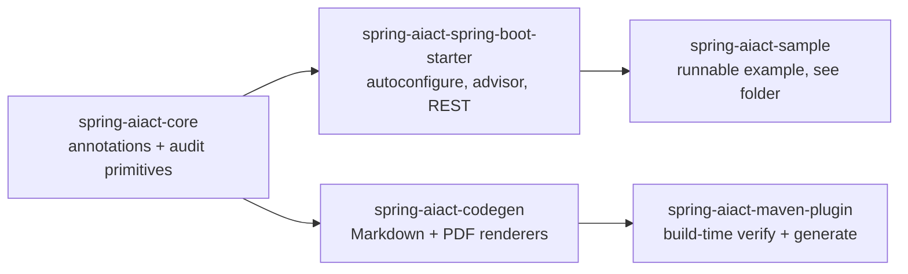
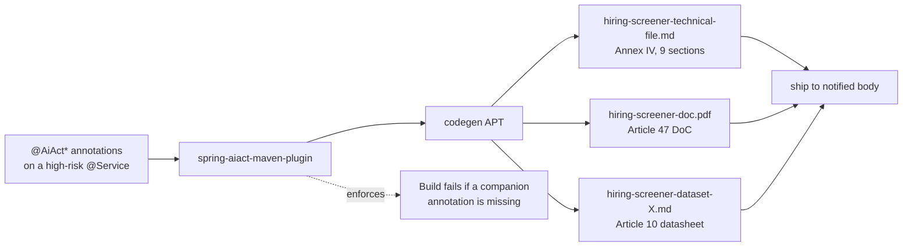
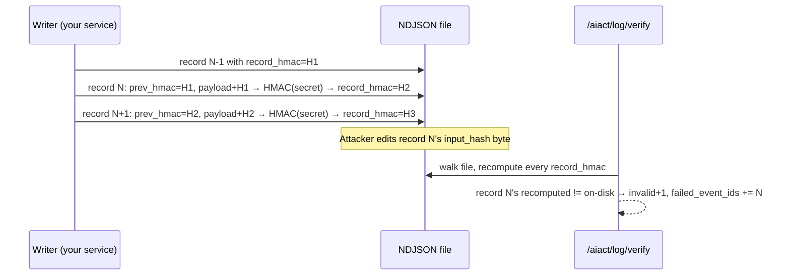

# spring-aiact

> **EU AI Act evidence, generated from your annotations.** Annotate one Spring Boot service, get an Article 12 audit log with a tamper-evident HMAC chain at runtime, plus an Annex IV technical file, an Article 47 Declaration of Conformity and per-dataset datasheets at every build. Apache 2.0, no SaaS, no data egress.

[](LICENSE)
[](https://openjdk.org/projects/jdk/21/)
[](https://spring.io/projects/spring-boot)
[](https://github.com/iambilotta/spring-aiact/actions/workflows/ci.yml)
[](https://github.com/iambilotta/spring-aiact/actions/workflows/codeql.yml)
[](https://jitpack.io/#iambilotta/spring-aiact)

```
For:     Lead engineer (Java/Kotlin) shipping an EU high-risk AI system
         (Annex III: HR/CV scoring, credit, biometrics, education, justice...)
Does:    Generates Annex IV technical file + Article 47 DoC at build,
         writes an Article 12 tamper-evident audit chain at runtime,
         enforces the four required companion annotations at compile time
Effort:  ~15 min first run on a fresh service, ~1h production-ready
         (HMAC secret in vault, AiActEndpointGuard wired, single-writer-lock)
Cost:    Apache 2.0, no SaaS, no data egress
Status:  v2.x active line (Spring Boot 4+), v1.x LTS line (Spring Boot 3.5+) frozen at v1.1.0. JitPack distribution.
Deadline: AI Act high-risk obligations enforce on 2 August 2026
```

[**Quick start**](#quick-start) ·
[**Architecture**](#architecture) ·
[**ADRs**](docs/adr/) ·
[**Performance**](#performance) ·
[**Threat model**](SECURITY.md#threat-model-1-page-summary) ·
[**Production guide**](docs/PRODUCTION.md) ·
[**Sample app**](spring-aiact-sample) ·
[**Reality check**](#reality-check) ·
[**Changelog**](CHANGELOG.md)

---

## The pitch in 30 seconds

You ship a Spring Boot service that runs CV scoring, credit decisions, or any other Annex III high-risk AI system. By **2 August 2026** the AI Act requires you to keep:

- a tamper-evident event log of every inference (Article 12),
- a technical file (Article 11 + Annex IV),
- a Declaration of Conformity (Article 47),
- per-dataset datasheets (Article 10),
- documented human oversight (Article 14).

Without this library the typical path is a 25k EUR/year SaaS dashboard configured by hand, plus a Confluence page maintained by whoever last got assigned the AI Act ticket. Both drift from the running code by the next sprint.

With this library you annotate the high-risk class once. Refactor the class, the dossier moves with it. Remove an annotation, the build fails with the missing companion named.

```java
@Service
@AiActHighRiskSystem(                                              // → Annex IV §1 General description
    id = "hiring-screener", name = "Hiring screener",
    category = AnnexIIICategory.EMPLOYMENT_AND_WORKERS_MANAGEMENT,
    annexSubpoint = "4(a)",
    intendedPurpose = "Score CV applicants for an engineering role.",
    provider = "ACME")
@AiActIntendedPurpose(                                             // → Annex IV §1 Instructions for use (Art. 13)
    deploymentContext = "HR triage before human review.",
    users = {"HR specialists"},
    foreseeableMisuse = {"Auto-rejection without human review"})
@AiActOversight(                                                   // → Annex IV §2 Article 14 oversight contract
    level = OversightLevel.HUMAN_IN_THE_LOOP,
    description = "Every output reviewed by HR.", overrideRole = "hr")
@AiActDataset(                                                     // → Annex IV §3 + Article 10 datasheet
    id = "cv-2025", name = "Anonymized CV corpus 2025", phase = "training",
    source = "internal-s3://cv-2025", size = "12,500", license = "internal",
    biases = {"under-representation of women in STEM"}, personalData = true)
@AiActAccuracyMetric(                                              // → Annex IV §6 Performance metrics (Art. 15)
    metric = RiskMetric.PRECISION, threshold = ">=0.92")
public class HiringScreener {
    @AiActLog(modelId = "hiring-screener@1.0.0")                   // → Article 12 audit chain
    public ScoringResult score(CandidateApplication application) {
        // your real scoring logic
    }
}
```

That single class is the source of truth for:

- a **9-section Annex IV Markdown technical file** regenerated at every `mvn verify`,
- a **PDF Declaration of Conformity** with signature placeholder,
- a **dataset datasheet** per `@AiActDataset`,
- a **runtime audit log** in NDJSON with an HMAC chain on every record,
- four **REST endpoints** for export, verify, head, and Article 14 oversight overrides.

A real run captured (committed under [`spring-aiact-sample/target/generated-docs/`](spring-aiact-sample) and in the cross-library demo's [`evidence/`](https://github.com/iambilotta/spring-gdpr-aiact-demo/tree/main/evidence) directory) shows what an auditor sees:

```bash
$ curl -u audit:audit-pass http://localhost:8080/aiact/log/verify?system=hiring-screener
{"systemId":"hiring-screener","inspected":3,"invalid":0,"failedEventIds":[]}
```

```bash
$ # tamper one byte of an old record
$ sed -i 's/sha256:b4fe/sha256:00fe/' aiact-logs/hiring-screener.ndjson
$ curl http://localhost:8080/aiact/log/verify?system=hiring-screener
{"systemId":"hiring-screener","inspected":3,"invalid":1,"failedEventIds":["08e1a981-..."]}
```

This is the property [Article 12](https://artificialintelligenceact.eu/article/12/) wants. The library does the bookkeeping.

## Architecture

`spring-aiact` ships as five Maven modules. Three are runtime, two are build-time. Adopters import the starter only; the rest comes for free.

### Module dependency graph



### Build-time pipeline (mvn verify)



### Runtime pipeline (per @AiActLog method invocation)

```mermaid
flowchart LR
    req[HTTP request hits<br/>@AiActLog method]
    advisor[AiActLoggingAspect<br/>Spring AOP]
    hash[PayloadHasher<br/>SHA-256 input + output]
    chain[HmacChain<br/>prev_hmac + record_hmac]
    sink[NdjsonAuditLogService<br/>append-only file lock]
    file[(./aiact-logs/&#123;systemId&#125;.ndjson)]
    rest1[GET /aiact/log/verify]
    rest2[GET /aiact/log/head]
    rest3[GET /aiact/log/export]
    rest4[POST /aiact/oversight/overrides]
    guard[AiActEndpointGuard SPI<br/>Spring Security, OPA, API key]

    req --> advisor --> hash --> chain --> sink --> file
    file --> rest1
    file --> rest2
    file --> rest3
    file --> rest4
    rest1 -. enforce .- guard
    rest2 -. enforce .- guard
    rest3 -. enforce .- guard
    rest4 -. enforce .- guard
```



### How the HMAC chain works in 5 seconds



Tamper one byte of any record on disk, every subsequent record fails verify because `prev_hmac` no longer matches. There is no way to silently delete a record either: the gap shows up as a missing chain link at the boundary. See [ADR-0004](docs/adr/0004-hmac-vs-digital-signature.md) for the choice of HMAC over digital signatures, and [SECURITY.md threat model](SECURITY.md#threat-model-1-page-summary) for what HMAC does and does not protect against.

## Quick start

Distributed via [JitPack](https://jitpack.io/#iambilotta/spring-aiact). **Maven Central is deliberately not planned**: this repo is a reference / portfolio asset of the maintainer, not a commercially supported product. See [ADR-0005](docs/adr/0005-jitpack-distribution-v1.md) for the full rationale.

> **Dual release line.** Pin the version that matches your Spring Boot.
>
> | Your stack | Pin |
> |---|---|
> | Spring Boot 3.5+ | `v1.1.0` (LTS line, frozen, no active maintenance) |
> | Spring Boot 4.0+ | `v2.0.0` (active line) |

### 1. Add the starter

```xml
<repositories>
    <repository><id>jitpack.io</id><url>https://jitpack.io</url></repository>
</repositories>

<dependency>
    <groupId>com.github.iambilotta.spring-aiact</groupId>
    <artifactId>spring-aiact-spring-boot-starter</artifactId>
    <version>v2.0.0</version>
</dependency>
```

### 2. Annotate your high-risk class

See the example in [The pitch in 30 seconds](#the-pitch-in-30-seconds). The Maven plugin will fail the build if any of the four companions (`@AiActIntendedPurpose`, `@AiActOversight`, `@AiActDataset`, plus `@AiActHighRiskSystem`) is missing.

### 3. Configure

```yaml
spring:
  profiles:
    active: dev                      # tolerates the default HMAC secret on this profile
aiact:
  hmac:
    secret: ${AIACT_HMAC_SECRET}     # generate with: openssl rand -hex 32
  log-dir: /var/log/aiact
  retention: P10Y
  audit:
    single-writer-lock: true         # required when more than one pod writes
  endpoints:
    enabled: true
    base-path: /aiact
    allow-without-guard: true        # FIRST RUN ONLY. Production wires a real guard, see below.
```

### 4. Wire the Maven plugin

```xml
<pluginRepositories>
    <pluginRepository><id>jitpack.io</id><url>https://jitpack.io</url></pluginRepository>
</pluginRepositories>

<plugin>
    <groupId>com.github.iambilotta.spring-aiact</groupId>
    <artifactId>spring-aiact-maven-plugin</artifactId>
    <version>v2.0.0</version>
    <executions><execution><goals>
        <goal>verify</goal>
        <goal>generate</goal>
    </goals></execution></executions>
</plugin>
```

### 5. Run

```bash
mvn verify              # generates the technical file + DoC + datasheets
mvn spring-boot:run     # boots the app, AOP advisor wires the audit log
```

The first invocation of any `@AiActLog` method appends a record. Verify the chain at `GET /aiact/log/verify?system={systemId}`.

A working end-to-end example is in [`spring-aiact-sample`](spring-aiact-sample) (clone-run-curl walkthrough in its [README](spring-aiact-sample/README.md)). A Docker Compose variant is in [`examples/docker-compose`](examples/docker-compose). Cross-library demo with `spring-gdpr`: [`spring-gdpr-aiact-demo`](https://github.com/iambilotta/spring-gdpr-aiact-demo).

## Audit sink: NDJSON or JDBC

The Article 12 chain is file-backed by default (`aiact.log-dir`), which is ideal on a host with a durable volume. On scale-to-zero / ephemeral runtimes (Cloud Run, Lambda, a pod without a persistent volume) the local filesystem does not survive a restart, so persist the chain to your database instead. **One flag** switches the sink, batteries included:

```yaml
aiact:
  audit:
    sink: jdbc          # default: ndjson
    jdbc:
      auto-ddl: true    # default: create aiact_audit_log if absent; set false if Flyway/Liquibase owns the DDL
```

That is all: the starter builds a `JdbcAuditLogService` over your existing `DataSource`, runs the idempotent `initSchema()` (unless `auto-ddl: false`), and the same HMAC-chained records, the same verify/head/export endpoints, and the same tamper-evidence apply, now in the `aiact_audit_log` table. The per-record chaining is serialised per `system_id` by an in-process lock plus a `SELECT ... FOR UPDATE` on the head, so multi-writer correctness across JVMs rides on the database row lock.

When a schema-migration tool owns the table, set `auto-ddl: false` and run the equivalent DDL there; the [`JdbcAuditLogService.initSchema()`](spring-aiact-core/src/main/java/com/iambilotta/spring/aiact/audit/JdbcAuditLogService.java) source is the canonical shape. Retention under the JDBC sink is the database operator's job (table partitioning / a scheduled `DELETE`); the NDJSON file-pruning sweeper does not apply.

## Production auth wiring

The first-run config sets `allow-without-guard: true`, which lets any local caller hit `/aiact/**`. Production must register an `AiActEndpointGuard` bean. Minimal Spring Security wiring:

```java
@Bean
AiActEndpointGuard aiActEndpointGuard() {
    return (systemId, action) -> {
        var auth = SecurityContextHolder.getContext().getAuthentication();
        if (auth == null || !auth.isAuthenticated()) {
            return AiActEndpointGuard.Decision.deny("not-authenticated");
        }
        boolean canRead = auth.getAuthorities().stream()
                .anyMatch(a -> a.getAuthority().equals("AIACT_READ"));
        boolean canWrite = auth.getAuthorities().stream()
                .anyMatch(a -> a.getAuthority().equals("AIACT_WRITE"));
        return switch (action) {
            case EXPORT_LOG, VERIFY_LOG, READ_HEAD ->
                canRead ? AiActEndpointGuard.Decision.allow()
                        : AiActEndpointGuard.Decision.deny("requires AIACT_READ");
            case SUBMIT_OVERRIDE ->
                canWrite ? AiActEndpointGuard.Decision.allow()
                         : AiActEndpointGuard.Decision.deny("requires AIACT_WRITE");
        };
    };
}
```

```yaml
spring:
  profiles:
    active: prod
aiact:
  endpoints:
    allow-without-guard: false       # production default
```

The starter does not depend on Spring Security; OPA, API key checks, mTLS subject mappings plug into the same SPI. OPA + multi-tenant examples in [`docs/PRODUCTION.md`](docs/PRODUCTION.md).

## Articles covered

| Article | What spring-aiact does |
|---|---|
| Article 10 | `@AiActDataset` declarations and per-dataset Markdown datasheets |
| Article 11 + Annex IV | Build-time Markdown technical file (9 sections) |
| Article 12 | NDJSON append-only audit log with HMAC chain. Tamper detection via `/aiact/log/verify` |
| Article 13 | `@AiActIntendedPurpose` populates the Instructions for Use section |
| Article 14 | `@AiActOversight` declarations and `POST /aiact/oversight/{eventId}/override` records overrides as second events linked to the original |
| Article 15 | `@AiActAccuracyMetric` declarations forwarded to the technical file |
| Article 47 | Declaration of Conformity PDF with signature placeholder |
| Annex VII | `AuditExportPackager` produces a signed ZIP for notified body submission |

## REST endpoints

| Method | Path | Purpose | Guard action |
|---|---|---|---|
| GET | `/aiact/log/export?system=&from=&to=` | Stream NDJSON slice | `EXPORT_LOG` |
| GET | `/aiact/log/verify?system=&from=&to=` | Chain verification report | `VERIFY_LOG` |
| GET | `/aiact/log/head?system=` | Current chain head HMAC (`ChainHead` record) | `READ_HEAD` |
| POST | `/aiact/oversight/{eventId}/override` | Record an Article 14 override | `SUBMIT_OVERRIDE` |
| GET | `/actuator/health/aiact` | Up/down + log dir, retention, multi-process status | none (Actuator) |

Every call passes through the configured `AiActEndpointGuard`. Default deny-all in production with reason `no-guard-configured`.

## Performance

Numbers are not "trust me, it is fast"; they are JMH-measured. Re-run the harness on your hardware:

```bash
./mvnw -B -DskipTests -pl spring-aiact-benchmark -am package
java -jar spring-aiact-benchmark/target/benchmarks.jar
```

Reference run on Corretto 25, Linux x86_64, `-wi 2 -i 3 -f 1`:

| What | Score |
|---|---|
| `PayloadHasher.hashSha256` (1 KB payload) | ~2 µs/op |
| `PayloadHasher.hashSha256` (10 KB payload) | ~15 µs/op |
| `HmacChain.chain` (typical record ~250 B) | ~0.9 µs/op |
| `NdjsonAuditLogService.append` with `single-writer-lock=true` | **~180 ops/sec** |
| `NdjsonAuditLogService.append` with `single-writer-lock=false` | ~83k ops/sec |

The `single-writer-lock=true` figure is the operationally important one. The lock + fsync per append caps single-writer throughput around 180 records/sec on local SSD. For an HR triage app at 10 req/sec, the audit chain costs are immeasurable next to the database. For a real-time scoring service at 1k+ req/sec, switch to single-writer-process mode (one pod writes), or wait for the JDBC sink in a future minor.

CPU side, the advisor adds sub-microsecond cost on a 1 KB payload; your endpoint will not feel it. Raw JSON: [`spring-aiact-benchmark/results/2026-05-02-jdk25-corretto.json`](spring-aiact-benchmark/results/2026-05-02-jdk25-corretto.json).

## Architecture decisions

The full decision rationale lives under [`docs/adr/`](docs/adr/). Highlights:

- [ADR-0001](docs/adr/0001-annotations-as-source-of-truth.md): annotations as source of truth.
- [ADR-0002](docs/adr/0002-ndjson-hmac-chain-vs-database.md): NDJSON + HMAC chain as default Article 12 sink.
- [ADR-0003](docs/adr/0003-spring-aop-advisor.md): Spring AOP advisor on `@AiActLog` (vs AspectJ LTW / Java agent).
- [ADR-0004](docs/adr/0004-hmac-vs-digital-signature.md): HMAC chain instead of per-record digital signatures.
- [ADR-0005](docs/adr/0005-jitpack-distribution-v1.md): JitPack as the v1.x distribution; Maven Central deliberately not planned (reference repo, no permanent release-pipeline maintenance).
- [ADR-0006](docs/adr/0006-internal-objectmapper-not-a-bean.md): audit-record `ObjectMapper` as implementation detail, not a Spring bean.
- [ADR-0007](docs/adr/0007-typed-chain-head-record.md): typed `ChainHead` record on `/aiact/log/head`.
- [ADR-0008](docs/adr/0008-encryption-at-rest-deferred.md) [proposed]: live encryption-at-rest deferred to v1.2.x; filesystem encryption is the v1.x answer ([design study](docs/ENCRYPTION.md)).

## Living requirements (tracegate)

This repo dogfoods [**tracegate**](https://github.com/iambilotta/tracegate): every test is
treated as a requirement, and the catalog is generated from the test suite, never written by
hand. Each module carries its own `_generated/` catalog (`requirements.md`,
`requirements-by-us.md`, `requirements.json`, plus as-built sections like `http-endpoints.md`
and `modules.md` where a framework is detected). The catalog covers
**83 requirements** across the five test-bearing modules.

The catalog is **generated, never hand-edited**. To change a requirement, change the test
(rename it, or add a `@spec.given` / `@spec.when` / `@spec.then` javadoc) and regenerate:

```bash
make tracegate-install   # one-off: install tracegate, pinned to the CI commit
make requirements        # regenerate every module's _generated/ catalog
make requirements-check  # drift-gate: exit 2 if the catalog drifted from the code
```

CI runs `make requirements-check`'s gate (the `tracegate` job in
[`.github/workflows/ci.yml`](.github/workflows/ci.yml)), so the committed catalog can never
silently fall out of sync with the code. tracegate is pinned to a commit in both the Makefile
(`TRACEGATE_REF`) and the workflow. Which modules are catalogued is pinned in
[`tracegate.toml`](tracegate.toml); add an `[[apps]]` block there when a new test-bearing
module appears.

## Operational notes the README will not let you skip

**Multi-pod deployment.** Audit log is one append-only NDJSON file per system id. With more than one pod writing to the same file, keep `aiact.audit.single-writer-lock=true` (default). Each append acquires an OS file lock, tails the file under the lock and recomputes the chain head from disk. On NFSv3 without lockd, `flock` is not reliable; prefer NFSv4 or a single-writer deployment.

**Retention prunes the chain seed.** When `RetentionPolicyService` removes records older than the configured horizon, the kept slice carries its original `prev_hmac` (the HMAC of the now-deleted predecessor). A verifier walking from `CHAIN_SEED` will see one mismatch on that boundary record. This is documented in `RetentionPolicyServiceTest`. Export before prune if you need pre-cutoff verifiability.

**Encryption at rest is filesystem-level for v1.x.** `AiActProperties.Encryption` is a placeholder; live AES-GCM is on the roadmap (see [ADR-0008](docs/adr/0008-encryption-at-rest-deferred.md) and [`docs/ENCRYPTION.md`](docs/ENCRYPTION.md)). For v1.x rely on filesystem encryption (LUKS, EBS-encrypted, EFS-at-rest).

**HMAC secret default in production.** Starter refuses to boot if `aiact.hmac.secret` is the placeholder `change-me-please` and no development profile is active. Set `aiact.hmac.fail-on-default-in-prod=false` only as an emergency hotfix.

## Reality check

What this library is NOT. Read this before adopting in production.

- **Not a certification.** Only a notified body certifies; the library produces the evidence pack you submit to one.
- **Not a wrapper around Logback.** Without the Annex IV generator, this would be an audit logger, not an AI Act compliance tool.
- **Not custom Annex III categories.** The enum reflects the eight official Annex III points; when the regulation is amended, the enum is amended.
- **Not a substitute for governance.** The annotations are a delivery vehicle for decisions your data governance and risk management process already made. Empty annotations produce visible gap markers, not hallucinated text.
- **Not a complete AI Act coverage.** Article 9 risk assessment, Article 17 quality management system, Article 71 EU database registration, Article 72 post-market monitoring, Article 73 incident reporting are out of scope today. The library is the IT-side evidence layer; the rest is your organisation's process.

Threat model + STRIDE table: [SECURITY.md](SECURITY.md#threat-model-1-page-summary).

## Roadmap

- **v2.0 (current, May 2026):** Spring Boot 4 active line. Apache 2.0, JitPack distribution, single SPI for auth (`AiActEndpointGuard`), file-locked NDJSON audit log with HMAC chain, deny-by-default endpoints, fail-fast on the default HMAC secret in production, configuration metadata, actuator health indicator, internal `ObjectMapper` no longer a Spring bean. OpenPDF 3.x.
- **v1.1.0 (LTS, frozen):** Spring Boot 3.5+ line. Same feature set as v2.0 except for the Spring Boot 4 / OpenPDF 3 migration. No active maintenance; security backports only on explicit request.
- **Future minor:** CI templates (GitHub Actions, GitLab, Jenkins) wrapping `verify`. JDBC-backed audit sink as an optional module. Multi-tenant isolation patterns documented. Spring Security autoconfiguration adapter as an opt-in extra module.
- **v2.1 candidate:** live encryption-at-rest ([ADR-0008](docs/adr/0008-encryption-at-rest-deferred.md), [docs/ENCRYPTION.md](docs/ENCRYPTION.md)).

**On distribution:** Maven Central is **not** on the roadmap and is unlikely to be added unless a real adopter explicitly requires it. This repo is a reference / portfolio asset; the cost of maintaining a Maven Central release pipeline (GPG key custody, immutable releases, Sonatype workflow) is permanent and only worth paying when there is a concrete adopter demand. JitPack covers the consumer use case at zero ongoing maintenance cost. See [ADR-0005](docs/adr/0005-jitpack-distribution-v1.md).

## About

Built by [Francesco Bilotta](https://iambilotta.com), Lead Software Engineer. The library is the externalised version of patterns I have wired into Spring Boot products in regulated environments (real estate, fintech-adjacent), where the same problem (tamper-evident audit + regenerable dossier from code) kept getting re-solved in private repos. `spring-aiact` is the Apache 2.0 distillation: same patterns, scoped to AI Act high-risk systems.

Sister repo [spring-gdpr](https://github.com/iambilotta/spring-gdpr) covers GDPR on the same evidence-as-code foundation. The two compose: a service that scores CVs typically falls under both regulations. Combined demo: [spring-gdpr-aiact-demo](https://github.com/iambilotta/spring-gdpr-aiact-demo).

Contact: francesco@iambilotta.com. Security reports: see [SECURITY.md](SECURITY.md). Support routing: see [SUPPORT.md](SUPPORT.md).

## License

Apache License, Version 2.0. See [LICENSE](LICENSE).
