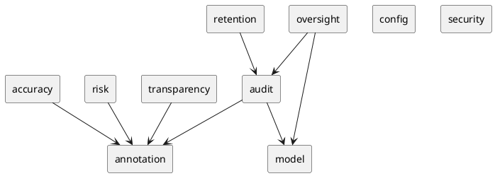

# Modules — spring-aiact-core (as-is)

Auto-generated. Modulith convention: each top-level package under `it.housetreespa.gest` is a module. Cross-module dependencies are inferred from `import it.housetreespa.gest.<other>.*` statements. A cycle in the graph below is a Modulith violation: open the offending module file and re-route the dependency through a port or an event.

**Total modules**: 10

✓ No module cycles.

## Module summary

| Module | Files | Sub-packages | Exposed API (@NamedInterface) | Depends on |
|---|---|---|---|---|
| `accuracy` | 3 | 1 | _(none)_ | `annotation` |
| `annotation` | 14 | 1 | _(none)_ | _(none)_ |
| `audit` | 9 | 1 | _(none)_ | `annotation`, `model` |
| `config` | 1 | 1 | _(none)_ | _(none)_ |
| `model` | 2 | 1 | _(none)_ | _(none)_ |
| `oversight` | 2 | 1 | _(none)_ | `audit`, `model` |
| `retention` | 1 | 1 | _(none)_ | `audit` |
| `risk` | 1 | 1 | _(none)_ | `annotation` |
| `security` | 4 | 1 | _(none)_ | _(none)_ |
| `transparency` | 1 | 1 | _(none)_ | `annotation` |

## Dependency graph (PlantUML, copy-pasteable)

## Detail

### `accuracy`

- **Files**: 3
- **Sub-packages** (1):
  - `accuracy`
- **Exposed API**: _(only the top-level package; no inner exports)_
- **Depends on**:
  - `annotation`

### `annotation`

- **Files**: 14
- **Sub-packages** (1):
  - `annotation`
- **Exposed API**: _(only the top-level package; no inner exports)_
- **Depends on**: _(no other gest module)_

### `audit`

- **Files**: 9
- **Sub-packages** (1):
  - `audit`
- **Exposed API**: _(only the top-level package; no inner exports)_
- **Depends on**:
  - `annotation`
  - `model`

### `config`

- **Files**: 1
- **Sub-packages** (1):
  - `config`
- **Exposed API**: _(only the top-level package; no inner exports)_
- **Depends on**: _(no other gest module)_

### `model`

- **Files**: 2
- **Sub-packages** (1):
  - `model`
- **Exposed API**: _(only the top-level package; no inner exports)_
- **Depends on**: _(no other gest module)_

### `oversight`

- **Files**: 2
- **Sub-packages** (1):
  - `oversight`
- **Exposed API**: _(only the top-level package; no inner exports)_
- **Depends on**:
  - `audit`
  - `model`

### `retention`

- **Files**: 1
- **Sub-packages** (1):
  - `retention`
- **Exposed API**: _(only the top-level package; no inner exports)_
- **Depends on**:
  - `audit`

### `risk`

- **Files**: 1
- **Sub-packages** (1):
  - `risk`
- **Exposed API**: _(only the top-level package; no inner exports)_
- **Depends on**:
  - `annotation`

### `security`

- **Files**: 4
- **Sub-packages** (1):
  - `security`
- **Exposed API**: _(only the top-level package; no inner exports)_
- **Depends on**: _(no other gest module)_

### `transparency`

- **Files**: 1
- **Sub-packages** (1):
  - `transparency`
- **Exposed API**: _(only the top-level package; no inner exports)_
- **Depends on**:
  - `annotation`
